# 오늘 뭐 듣지? — 실시간 음악 대결 시스템

두 곡을 겨루게 하고, 방문자와 회원의 투표로 승자를 가리는 **1 vs 1 음악 배틀 플랫폼**.
승자는 포인트를 얻고, 획득한 포인트로 뽑기를 돌려 시스템 내 아이템(칭호·프로필 아이콘)을 습득할 수 있다.

- **Backend** — Spring Boot (Java 21) + MySQL + Redis
- **Frontend** — React + TypeScript + Tailwind
- **Infra** — Docker Compose, Nginx 리버스 프록시
- 1인 프로젝트 · 코드/API 식별자는 도메인명 `battle`을 사용

> **배포 링크** — http://musictest.kro.kr

## 목차
- [기술 스택](#기술-스택)
- [아키텍처](#아키텍처)
- [핵심 기능](#핵심-기능)
- [설계상 눈여겨볼 지점](#설계상-눈여겨볼-지점)
- [개발 히스토리](#개발-히스토리-주요-변경점)
- [아직 구현되지 않은 것](#아직-구현되지-않은-것)

---

## 기술 스택

| 영역 | 사용 기술 |
|---|---|
| **Backend** | Java 21, Spring Boot 4.x (Web MVC · Data JPA · Validation · Security), JPA/Hibernate |
| **Auth** | JWT(jjwt) access/refresh 토큰, Google OAuth, Gmail 이메일 인증, reCAPTCHA |
| **Realtime** | WebSocket / STOMP |
| **Database** | MySQL(영속 계층), Redis(분산 락 · 어뷰징 방지 · 회원가입 임시 캐시) |
| **Frontend** | React 18 + TypeScript, Vite, React Router, Tailwind CSS, YouTube IFrame/Data API v3 |
| **Infra** | Docker 컨테이너화, AWS EC2, Nginx 리버스 프록시 |

---

## 아키텍처

### 시스템 구성도

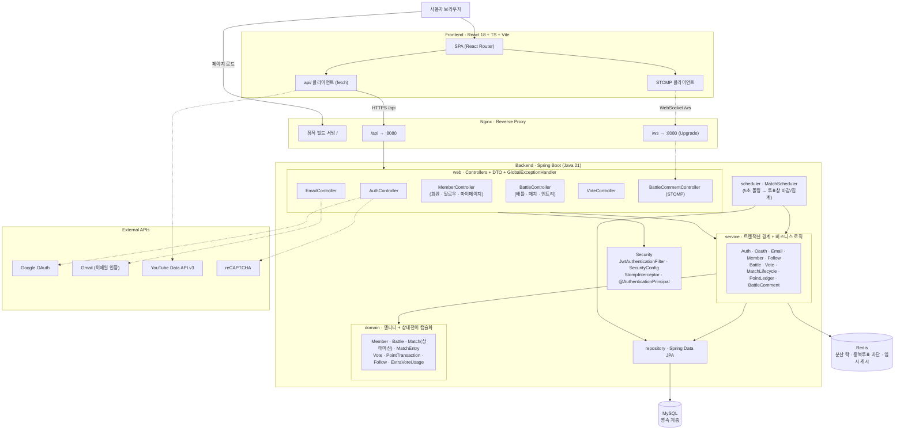

### 매치 상태 머신

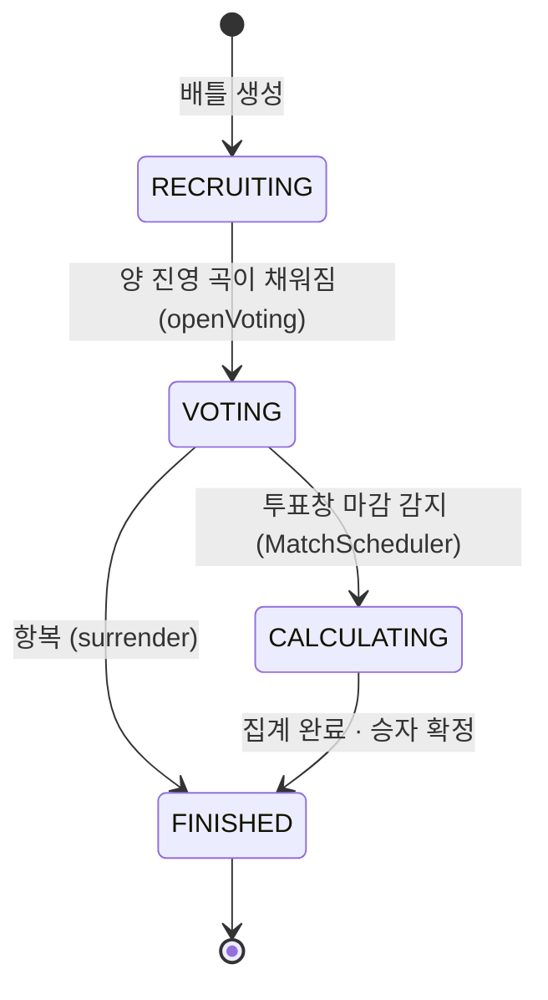

### 패키지 구조

```text
backend/src/main/java/com/musicbattle/
  domain/       엔티티 + 상태 전이 로직 (전이 메서드를 엔티티 안에 캡슐화, Anemic Domain 지양)
  domain/enums/ 상태·유형 enum
  repository/   Spring Data JPA 인터페이스
  service/      트랜잭션 경계 + 비즈니스 로직
  scheduler/    @Scheduled 매치 라이프사이클 폴링
  web/          컨트롤러 + DTO + 전역 예외 처리(GlobalExceptionHandler)
  config/       Redis · Security/JWT · WebSocket/STOMP · 도메인 규칙 ConfigurationProperties
  util/         IP 해시 · JWT 토큰 · 응답 조립(BattleSummaryAssembler)

front/music-battle-frontend/src/
  types/api.ts  백엔드 DTO(record)와 1:1 대응하는 TypeScript 타입 (현재는 수동 동기화)
  api/          Auth / Member / Battle / Vote 컨트롤러 대응 클라이언트
  auth/         JWT 보관 + AuthContext (프론트 권한 UI는 UX 편의, 실제 인가는 서버가 담당)
  components/   BattleCard · VotePartition · YoutubeSearchBox 등 공용 컴포넌트
  pages/        BattleList / BattleDetail / CreateBattle / Login / MyPage / Profile
```

---

## 핵심 기능

> 기능 위주로 서술하며, 구조·설계는 [설계상 눈여겨볼 지점](#설계상-눈여겨볼-지점)에 정리했다.

<p align="center">
  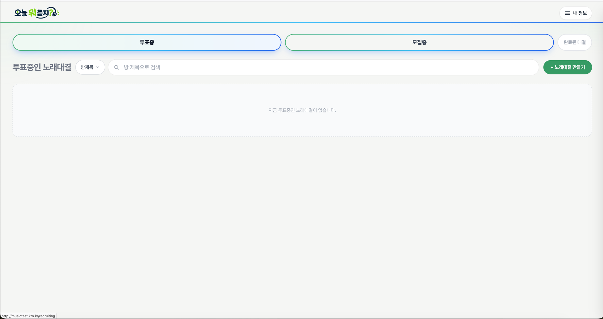
</p>

### 회원가입 · 로그인 — `MemberController` · `AuthController` · `EmailController`
로그인은 JWT **access + refresh** 토큰을 사용한다. 회원가입은 Gmail API를 이용한 **이메일 인증**을 거치며, 소셜 로그인은 외부 OAuth 콜백을 받아 기존 회원가입 로직과 연동한다.

<p align="center">
  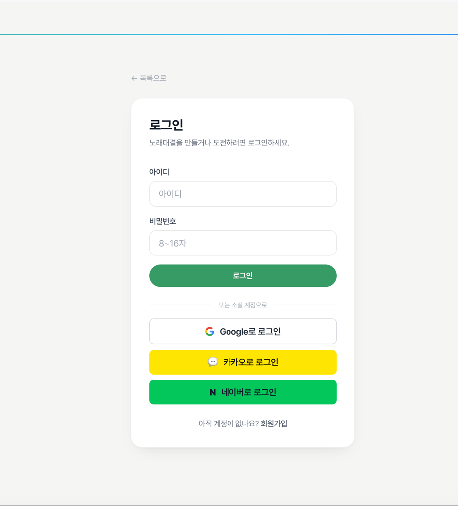
  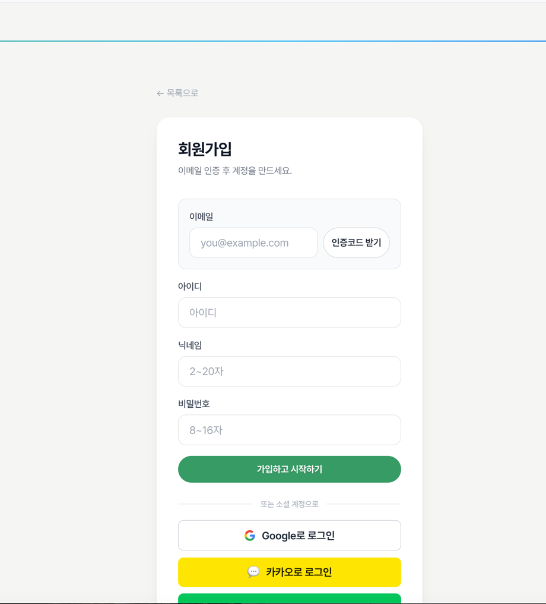
</p>

### 배틀 생성 — `BattleController`
노래의 제목 또는 URL을 입력해 원하는 곡을 등록한다(YouTube Data API v3). 투표 시간과 제목을 정한 뒤 배틀을 생성하면 참가자를 모집한다. **최대 동시 생성 3건.**

<p align="center">
  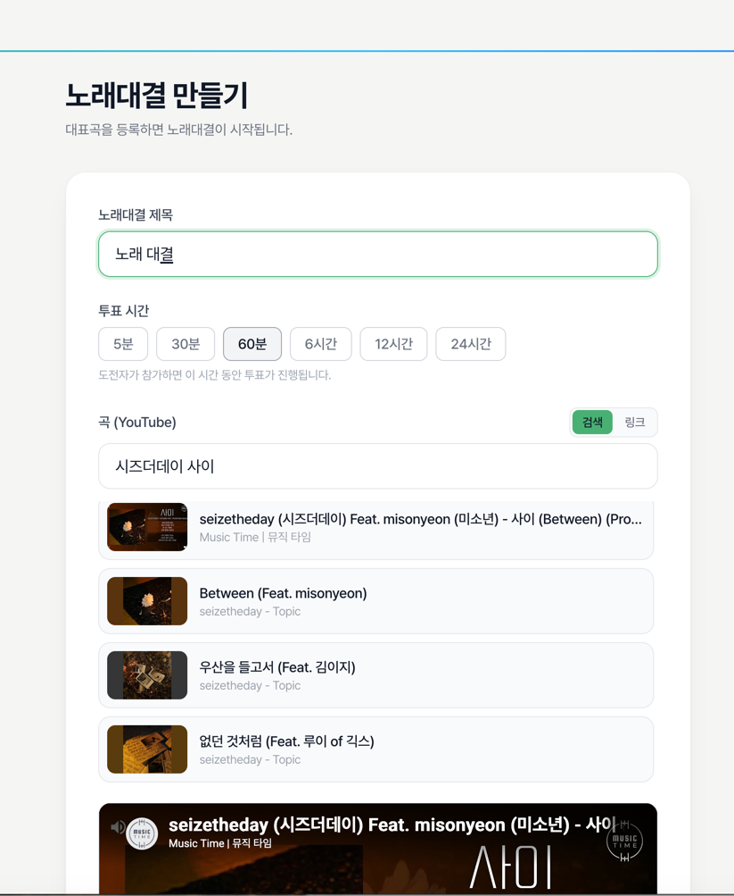
  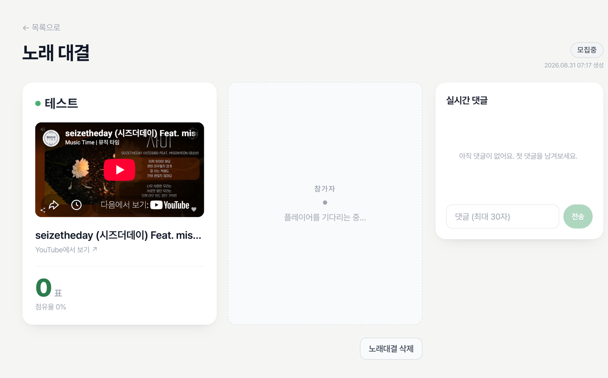
</p>

### 배틀 참가 — `BattleController`
로그인한 사용자는 모집 중인 대결에 자신의 곡으로 참가할 수 있다.

<p align="center">
  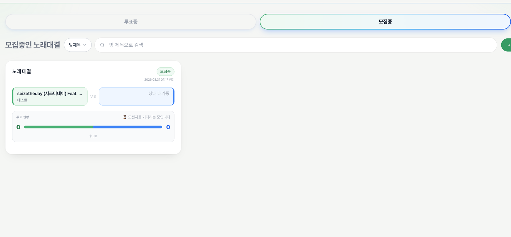
  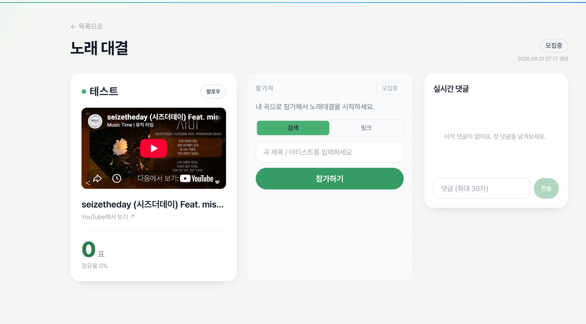
</p>

### 투표 — `VoteController`
익명/로그인 모두 투표 가능하다. 로그인 투표는 가중치 **+3**, 동일 IP는 Redis 캐시에 기록해 중복을 차단한다. **항복 시스템**으로 대결을 조기 종료할 수 있다.

<p align="center">
  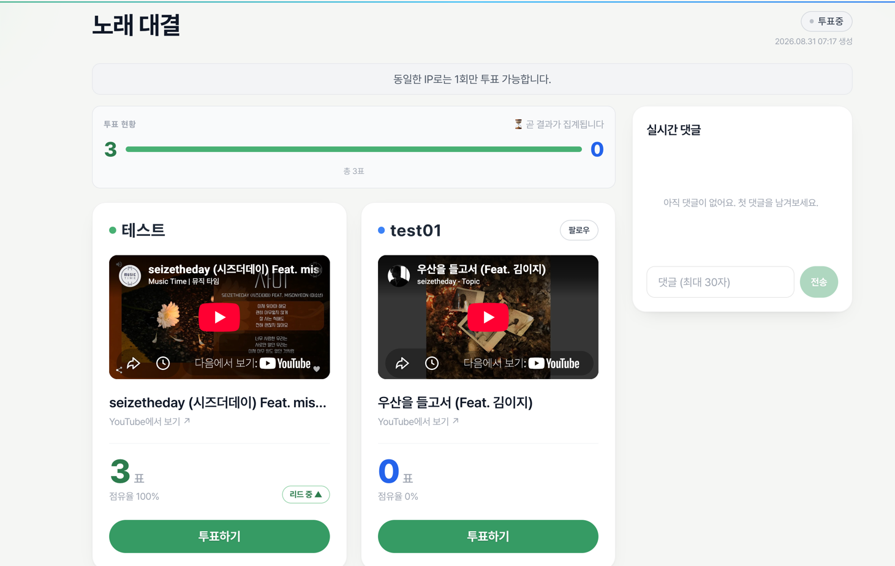
</p>

### 실시간 채팅 — `BattleCommentController`
WebSocket(STOMP) 기반 실시간 채팅으로 배틀을 보며 즉시 소통한다.

<p align="center">
  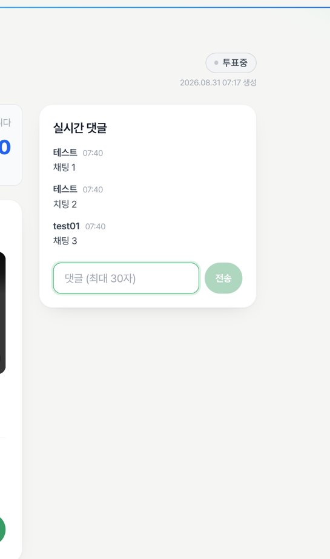
</p>

### 팔로우 — `MemberController`
타인의 프로필 또는 대결 중인 매치에서 팔로우할 수 있다. 내 팔로우/팔로워는 "내 정보"에서 확인하며, 타인은 팔로워/팔로잉 **수만** 확인 가능하다.

<p align="center">
  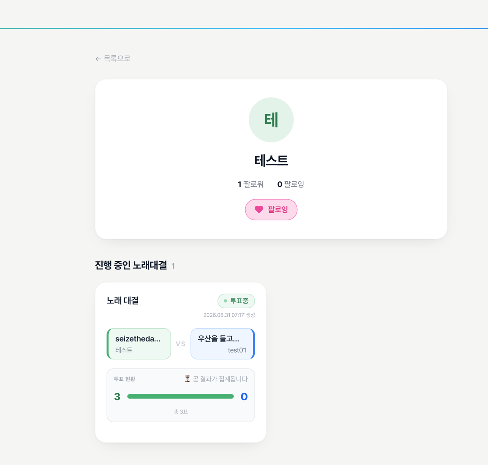
</p>

### 내 정보 · 마이페이지 — `MemberController`
팔로우/팔로워 목록, 포인트, 마이페이지를 조회한다. 마이페이지에서는 참여한 대결 목록과 회원 탈퇴 등을 제공한다. *(커스터마이징 기능 설계 예정)*

<p align="center">
  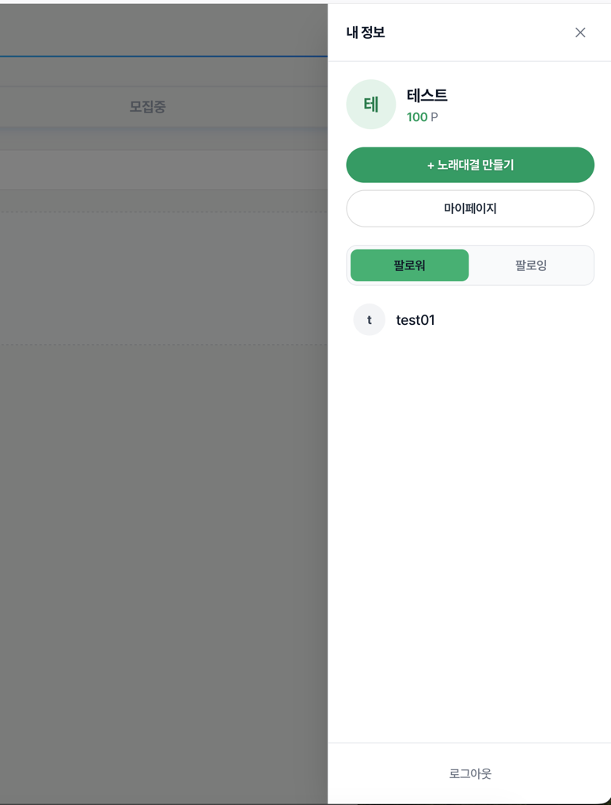
  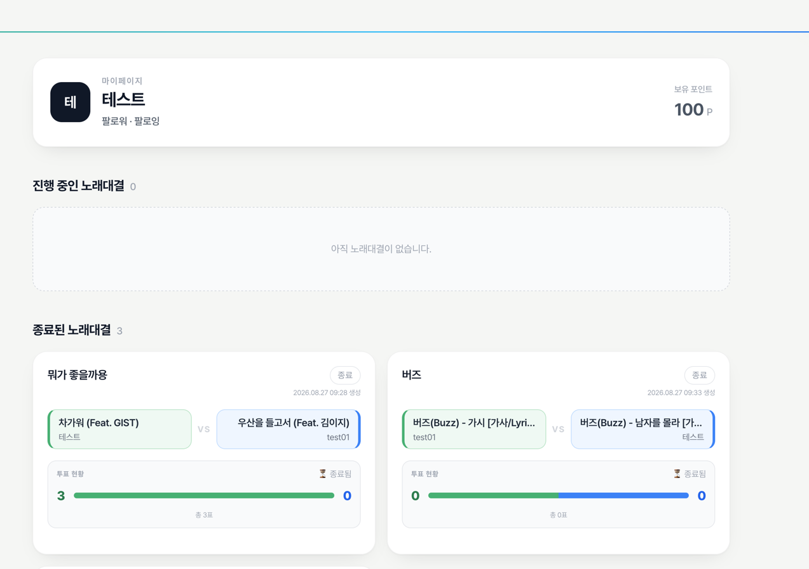
</p>

### API 요약
- **배틀 생성 · 목록 · 상세 · 참가(도전) · 삭제 · 항복** — `BattleController` 기준 REST API 전체
- **1 vs 1 매치 상태머신** — `RECRUITING → VOTING → CALCULATING → FINISHED`, 상태 전이 로직을 엔티티 안에 캡슐화하고 잘못된 전이는 즉시 예외 처리
- **투표 & 어뷰징 방어** — 비로그인(+1) / 로그인(+3) 가중 투표, 방당 추가 투표권 2회 캡, 본인 참여 배틀 투표 락. 실시간 중복 투표 차단은 Redis `SET NX`(IP 해시 + 핑거프린트, TTL 24h)가 담당하고 MySQL `vote` 테이블은 감사 기록 역할
- **포인트 원장** — 모든 포인트 가감을 `PointTransaction`에 기록하는 원장(ledger) 패턴, `Member.pointBalance`는 캐시일 뿐
- **매치 라이프사이클 스케줄러** — 5초 폴링으로 투표창 마감/집계를 자동 처리, 매치 1건 실패가 나머지 매치를 막지 않도록 예외 격리
- **동시성 제어** — 주요 엔티티(`Member`/`Battle`/`Match`/`MatchEntry`/`ExtraVoteUsage`)에 `@Version` 낙관적 락. 스케줄러의 매치 집계만 비관적 락(`findByIdForUpdate`)으로 동일 매치 중복 집계 방지
- **YouTube 검색 연동(선택 기능)** — `VITE_YOUTUBE_API_KEY`가 있으면 곡 등록 시 검색 탭이 활성화되고, 없으면 링크 붙여넣기로 자동 폴백

---

## 설계

- **`ddl-auto: validate`** — 로컬 개발이라도 스키마를 자동 변경하지 않고 명시적으로 관리
- **Redis / MySQL 책임 분리** — 락·실시간 차단(Redis)과 영속 기록(MySQL)의 책임을 분명히 나눠 장애 원인 추적을 쉽게 함
- **도메인 규칙 외부화** — 투표 가중치, 투표창 길이, 연승 배수 등을 `application.yml`의 `battle.*`로 관리(매직넘버 지양)
- **같은 출처 원칙** — 개발은 Vite 프록시, 배포는 Nginx가 정적 프론트를 서빙하면서 `/api`·`/ws`만 백엔드로 리버스 프록시. 프론트가 항상 같은 출처로만 요청해 CORS를 원천 회피

---

## 개발 히스토리 (주요 변경점)

| 단계 | 내용 |
|---|---|
| 1. 도메인 설계 | `Match` 상태머신, `Battle`/`MatchEntry`/`Vote`/`PointTransaction` 등 핵심 엔티티와 낙관적 락 동시성 모델 설계 |
| 2. 투표 어뷰징 방어 | Redis `SET NX` 기반 실시간 중복 투표 차단, 가중 투표(비로그인 +1 / 로그인 +3)와 추가 투표권 캡 설계 (기획 원안의 +5~10 가중치는 계정 양산 공격을 유발할 수 있어 +3으로 하향) |
| 3. 매치 라이프사이클 자동화 | `MatchScheduler` 폴링 기반 투표창 마감/집계, 매치별 예외 격리, 집계 시점만 비관적 락으로 전환 |
| 4. 인증/인가 | 회원가입, JWT access/refresh 로그인, `JwtAuthenticationFilter`, IP 해시(`IpUtilities`) 도입 |
| 5. 배틀 REST API | 배틀 생성/목록(페이지네이션)/상세/참가/삭제/항복 엔드포인트 구현, `BattleSummaryAssembler`로 응답 조립 분리 |
| 6. 프론트엔드 초기 구축 | Vite + React + TS + Tailwind 세팅, 백엔드 DTO와 1:1 대응 타입 체계, Vite 프록시로 CORS 회피 |
| 7. 프론트-백엔드 계약 보강 | 프론트 개발 중 발견된 API 공백(상세 응답 `matchEntryId` 부재, 배틀 목록 API 부재, status가 Match가 아닌 Battle 기준 등)을 백엔드에 역반영 |
| 8. YouTube 검색 연동 | `VITE_YOUTUBE_API_KEY` 유무로 검색/링크 붙여넣기를 자동 전환하는 선택적 기능 추가 |
| 9. 실시간 채팅 · 팔로우 | STOMP 실시간 댓글, 팔로우/팔로워 시스템(프로필·매치에서 팔로우, "내 정보"에서 목록 확인) 추가 |
| 10. 프론트 권한 UX 정리 | 삭제/항복 버튼 노출을 프론트에서 조건부로 숨기되, 실제 인가는 항상 서버 `@AuthenticationPrincipal`이 최종 판단하도록 경계 명확화 |
| 11. reCAPTCHA · 이메일 인증 | 회원가입에 reCAPTCHA와 Gmail 이메일 인증 코드 흐름을 붙여 가입 로직 강화 |
| 12. 소셜 로그인 | Google OAuth 콜백을 프론트 콜백 페이지(`/oauth/callback`)에서 받아 기존 회원가입 로직과 연동 |
| 13. Git 저장소 초기화 | 시크릿(DB 비밀번호, JWT 시크릿) 하드코딩을 환경변수 + gitignore 로컬 오버라이드로 분리 |
| 14. Docker 배포 | `docker-compose.yml`(MySQL/Redis/backend/nginx), 백엔드 멀티스테이지 `Dockerfile`, Nginx 리버스 프록시 추가. 시크릿은 루트 `.env`(gitignore)로 주입 |
| 15. 브랜딩·디자인 리뉴얼 | 서비스명을 **"오늘 뭐 듣지?"**, 사용자 문구를 **"노래대결"** 로 통일(코드/API 식별자는 `battle` 유지). 초기 다크+네온 스타일을 **라이트 + 스포티파이 그린 액센트**의 절제된 팔레트로 재정리 |
| 16. 배포 버그 수정 | 구글 OAuth `redirect_uri`를 프론트 콜백 경로로 교정, 웹소켓 주소를 접속 호스트 기준으로 동적 생성(하드코딩 제거), 환경변수(`.env.production`) 분리 |

---

## 아직 구현되지 않은 것

- **랠리(Rally) 모드** — 큐(Redis List)와 상태 관리. `BattleMode.RALLY`는 정의되어 있으나 서비스 로직 미구현
- **토너먼트 대진표** — `Match.nextMatchId` 자리만 마련되어 있고 브라켓 진행 로직은 없음
